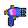

# Dynamic Worlds Sprite Brief

This doc is for a friendly art handoff, not a rigid spec sheet.

The current sprites work, but they are placeholder-quality. The goal is to replace them with tool sprites that feel more intentional, readable, and Terraria-like at item scale.

No animation is needed.

## Quick Summary

- Live tool sprite size: `32x32`
- Transparent background
- Terraria item readability matters more than tiny detail
- Strong silhouette and clear outline are more important than realism
- These are tools, not weapons, even if some of them can look a little dramatic
- Creative freedom is welcome as long as they still feel like they belong in Terraria

## General Visual Direction

The mod has a weird reality/world-manipulation theme, so the tools can lean magical, sci-fi, surveying-tech, or some mix of those. The important part is that they should feel like specialized Terraria tools used to alter the world itself.

Things that would help:

- Chunky, readable pixel shapes
- Clear dark outline / border definition
- One strong focal element per sprite
- Color-coding between tools so each one is instantly recognizable
- A shared “family” feel so the set looks cohesive

Things to avoid:

- Overly soft or blurry shapes
- Tiny details that disappear at Terraria scale
- Just shrinking a normal illustration down and calling it pixel art
- Making them read like swords, guns, or generic magic staffs unless that is very intentional

## Terraria Fit

The sprites do not need to copy vanilla Terraria exactly, but they should feel comfortable next to Terraria tools and accessories:

- readable at a glance
- not too noisy
- strong contrast
- simple but deliberate materials
- pixels are big enough to matter

If it helps, think “iconic tool silhouette first, cool surface detail second.”

## Priority

If only some sprites get redone first, the order of importance is:

1. Structure Anchor
2. Reality Anchor
3. Reality Eraser
4. Biome Dowser

There is also a `Prefab Tool`, but it currently just reuses the Structure Anchor sprite, so it is low priority for now.

## Current Sprites

### Reality Anchor

Current file:
`DynamicWorlds/Preservation/RealityAnchor.png`

Current sprite:

What it does:

- Saves exact tiles so they survive world regeneration
- Preserves blocks, walls, liquids, wires, storage contents, beds, etc.
- It is the “protect / preserve / lock this in place” tool

General vision:

- Should feel stabilizing, protective, precise, and deliberate
- Could read like a reality-locking device, anchor mechanism, or arcane surveying instrument
- Best if it feels constructive rather than destructive

Possible directions:

- crystal core + metal prongs
- anchor-like motif without becoming a literal ship anchor
- calibrated handheld device with a glowing center
- relic/tool hybrid with a “binding” or “pinning” vibe

Recommended color feel:

- cool, controlled, protective colors
- blues, cyan, silver, pale violet, maybe a little gold

Desired read:

- “This tool locks the world in place.”

### Reality Eraser

Current file:
`DynamicWorlds/Preservation/RealityEraser.png`

Current sprite:

What it does:

- Marks tiles to be removed after world regeneration
- Keeps tunnels, arenas, shafts, and open spaces from filling back in
- It is the “clear this out / remove this from the rebuilt world” tool

General vision:

- Should feel like the counterpart to Reality Anchor
- Same general family, but more aggressive, unstable, or subtractive
- Should still read as a tool, not just an evil weapon

Possible directions:

- paired design language with the Anchor but more jagged / broken / void-like
- dissolving edge, split ring, broken emitter, collapsing crystal
- tool that looks like it cuts holes in reality rather than blasting enemies

Recommended color feel:

- warmer or more dangerous contrast than the Anchor
- magenta, red-orange, void purple, hot pink, dark metal, black accents

Desired read:

- “This tool deletes space.”

### Structure Anchor

Current file:
`DynamicWorlds/Preservation/StructureAnchorItem.png`

Current sprite:

What it does:

- Saves an entire structure zone instead of individual tiles
- Used for houses, bases, outposts, and whole builds
- Restores the build as a unit after regen

General vision:

- This one should feel the most like an actual tool
- It is the construction / projection / surveying device of the set
- It should read like something you’d use to scan, project, or box out a structure

Possible directions:

- handheld projector
- terrain scanner
- builder’s measuring device
- construction-tech tool with a hologram or framing element

Recommended color feel:

- clear, confident, engineered
- cyan, green, yellow, orange, white, steel, or another “builder tech” palette

Desired read:

- “This tool captures and re-places whole buildings.”

### Biome Dowser

Current file:
`DynamicWorlds/Preservation/BiomeDowser.png`

Current sprite:

What it does:

- Captures a pylon structure and relocates it into a matching biome on regen
- Used for pylon buildings and biome-specific placement logic
- It is the most “finder / locator / divining instrument” tool in the mod

General vision:

- Should feel like a detector, divining rod, survey instrument, compass, or biome scanner
- It can be a little stranger or more mystical than the Structure Anchor
- It should still belong to the same family as the other tools

Possible directions:

- forked scanner / tuning prongs
- compass-like device
- pylon-tracking instrument
- biome reader with a crystal lens or signal dish

Recommended color feel:

- exploratory / attuned / environmental
- teal, green, sky blue, gold, white, or prismatic accents

Desired read:

- “This tool finds the right place in the world.”

## Shared Set Notes

It would be great if the four tools feel related, like they were built by the same people / magic system / tech system.

A good way to do that would be:

- similar border treatment
- recurring materials
- recurring crystal/emitter/core motifs
- consistent shading logic
- distinct palettes but shared construction language

The best outcome is probably:

- `Reality Anchor`: preserve / stabilize
- `Reality Eraser`: remove / void
- `Structure Anchor`: build / project / frame
- `Biome Dowser`: search / tune / locate

## Flexibility

This is intentionally not super restrictive. If a better idea comes up that still matches the purpose and reads well in Terraria, go with the better idea.

The current sprites are references for function and slot only, not a target style.

## Delivery

Ideal export:

- `32x32` PNG
- transparent background
- centered cleanly enough to look good in Terraria inventory / held-item use

If helpful, rough concepts or a couple alternate silhouettes first would totally work before polishing final versions.
